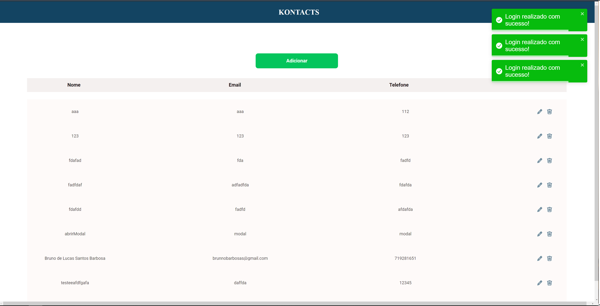

# Lista de contatos com ReactJS
## Por: [Bruno de Lucas @brunobarbosas](https://github.com/brunobarbosa17)

##### Neste sistema utilizei ReactJS, pude consolidar conceitos de Rotas, Responsividade, ContextAPI e em breve Refatoração 😝
##### É possível fazer :
* Novo cadastro
* Realizar login através de autenticação com um token gerado
* Inserir novos contatos na agenda
* Editar contatos  
* Excluir contatos
##### É possível testar atráves do link: https://lista-contatos-bruno-barbosa.herokuapp.com/

# 🚀🚀🚀🚀🚀🚀🚀🚀🚀🚀🚀🚀🚀🚀🚀🚀🚀🚀

## Demonstração 

# 🚀🚀🚀🚀🚀🚀🚀🚀🚀🚀🚀🚀🚀🚀🚀🚀🚀🚀
# Tela de Login

# Tela de Cadastro

# Tela Principal

